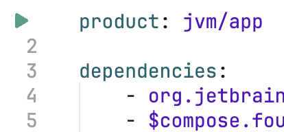

# The technology

Poké-Fun is implemented using [Kotlin](https://kotlinlang.org/), [Arrow](https://arrow-kt.io/), and [Compose Multiplatform](https://www.jetbrains.com/lp/compose-multiplatform/). The latter has been chosen because it provides the same concepts to build user interfaces in a variety of platforms. In particular, we can write a desktop application that runs easily everywhere (the perks of using the JVM 😉).

The one choice which goes out of the ordinary is using [Amper](https://github.com/JetBrains/amper) as build tool, instead of Gradle, much better-known among Kotliners. Feel free to look at the `module.yaml` file, but for the tasks you won't need to touch it. To start the application you can run `./amper run` in a command line. The first time it may take some time to start, since build tools, compiler, and dependencies need to be set up.

We recommend using [Fleet](https://www.jetbrains.com/fleet/) or [IntelliJ IDEA](https://www.jetbrains.com/idea/) to work on Poké-Fun. If you use the latter, you need the corresponding [Amper plug-in](https://plugins.jetbrains.com/plugin/23076-amper). In both cases, you should see a small play button to run the application from the IDE.



## Compose Multiplatform

In the recent years we have seen an explosion of a new paradigm for UI development, based on managing the state separately from the view, which is then defined as a function which is re-executed everytime the state changes. Some well-known frameworks include [React](https://react.dev/) for web, [SwiftUI](https://developer.apple.com/xcode/swiftui/) for iOS, and [Jetpack Compose](https://developer.android.com/develop/ui/compose) for Android. [Compose Multiplatform](https://www.jetbrains.com/lp/compose-multiplatform/) uses the same concepts of the latter, but targeting several platforms (at the time of writing: desktop, Android, iOS, and web via WebAssembly).

```admonish info title="More about Compose Multiplatform"

There is still not much documentation about Compose Multiplatform, but most of the information about Jetpack Compose (for Android) applies only with minor modifications.

- [Android Basics with Compose](https://developer.android.com/courses/android-basics-compose/course),
- [Jetpack Compose guides](https://developer.android.com/develop/ui/compose/documentation) from Google,
- [Create a Compose Multiplarform app](https://www.jetbrains.com/help/kotlin-multiplatform-dev/compose-multiplatform-getting-started.html),
- [Philipp Lackner](https://www.youtube.com/@PhilippLackner/videos) has videos covering Compose Multiplarform.

```

Compose applications are typically built from two components:

- _View models_ keep (part of) the state of the application, and communicate with the outside world.
- _Views_ define how this state is mapped into a set of UI elements laid out in the screen. Views as defined by `@Composable` functions.

Let us look at the simplest application: a button which counts how many times it has been pressed. The state is basically a counter.

```kotlin
class Counter: ViewModel() {
  // 1. define a state, starting with 0
  private val _count = mutableStateOf(0)

  // 2. expose the state in a read-only manner
  val count: Int = _count.value

  // 3. operations to change the state
  fun increment() {
    _count.value++
  }
}
```

The view consumes this view model, and shows a button with a text indicating the amount of times it has been clicked.

```kotlin
@Composable fun Screen(counter: Counter) {
  Button(onClick = { counter.increment() }) {
    Text("Clicked ${counter.count} times")
  }
}
```

What happens when the button is pressed? Then the `onClick` lambda is executed, which eventually changes the value of `_count`. Compose detects this change and _recomposes_ the UI, that is, re-executes `Screen` and applies any update to the visible screen. The `@Composable` annotation is the magic that makes this link work.

Armed with this knowledge, you can read the [introduction](./intro.md) to Poké-Fun.
